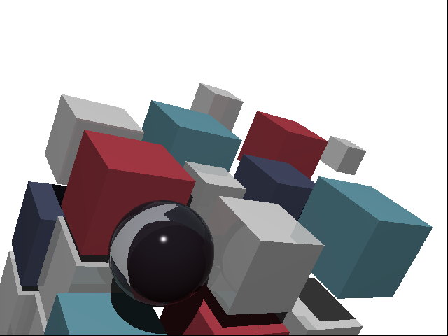

# Ray Tracer Chalenge

A simple ray tracer implementation as outlined in the book [The Ray Tracer Challenge](https://pragprog.com/titles/jbtracer/the-ray-tracer-challenge/)
written in the [Rust](https://www.rust-lang.org) programming language.

## Examples

 

 
